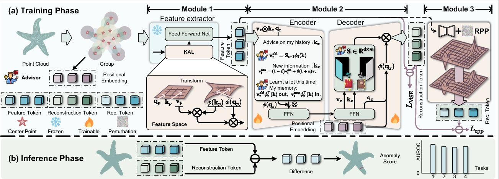

# Continuous Learning for 3D Anomaly Detection (CL3AD)

This is the official implementation of paper 'C3D-AD: Toward Continual 3D Anomaly Detection via Kernel Attention with Learnable Advisor'.

Haoquan Lu, Hanzhe Liang, Jie Zhang, Chenxi Hu, Jinbao Wang, Can Gao.

For code-related issues, please contact Hanzhe Liang (email: lianghanzhe2023@email.szu.edu.cn).

For paper-related questions, please contact Haoquan Lu (email: 2200271072@email.szu.edu.cn).



## 1. Quick Start

### 1.1 Requirements
- **Conda virtual environment creation**
```
conda create -n CL3AD python=3.8
conda activate CL3AD
pip install -r requirements.txt
pip install "git+https://github.com/erikwijmans/Pointnet2_PyTorch.git#egg=pointnet2_ops&subdirectory=pointnet2_ops_lib"
pip install --upgrade https://github.com/unlimblue/KNN_CUDA/releases/download/0.2/KNN_CUDA-0.2-py3-none-any.whl
```

### 1.2 Checkpoints
- **Download feature extractor pre-trained weights.**
Point-MAE pre-trained weights can be downloaded [here](https://github.com/Pang-Yatian/Point-MAE/releases/download/main/modelnet_8k.pth). After downloading, place the `modelnet_8k.pth` file in the `./pretrain_ckp` directory

- **Download checkpoints of model. (Optional)**
After downloading from [here](https://1drv.ms/f/c/0d5b79478e08e65d/EjgZ4YRYrM5IvLr1B1HORIMBSqbA2oCT2P9Xd5zUEemPkQ?e=motzY2), place the `ckpt_best.pth.tar` file in the `experiments/[dataset]/[load_path from config.yaml]` directory. For example, `experiments/real3d/checkpoints_x`

### 1.3 Real3D-AD

- **How to get the Real3D-AD dataset**. Download the Real3D-AD dataset from [here](https://drive.google.com/file/d/1oM4qjhlIMsQc_wiFIFIVBvuuR8nyk2k0/view?usp=sharing). After downloading, unzip it to the directory you specified.

- **Real3D Downsampling.** To simplify the training, you first need to downsampling the training set of Real3D. You can use the following command:
`
python downsample_pcd.py --radl3d_path <Path/to/your/Real3D-AD-PCD>
`
After the above operations are completed, the `real3D_down` directory will be created in the same directory layer as `Real3D-AD-PCD`.
- **cd the experiment directory** by running `cd ./experiments/real3d/`. 

- **Modify the config.yaml.** Please set the `dataset.data_dir` and `net.data_dir` of `config.yaml` to load the absolute path of your Real3D-AD-PCD.

- **Train or eval** by running: 

    `sh train.sh 1 #GPU_ID` or `sh eval.sh #1 #GPU_ID`.

    **Note**: Multi-gpu training is not currently supported. During eval, please *set the saver.load_path of config.yaml* to load the checkpoints. 

- **Different continual tasks** Please match the `dataset.task_num`, `dataset.train / test.meta_file`, `cls_dataset.train / test.meta_file`, `saver.load_path`, `saver.save_dir`, `evaluator.save_dir`.

### 1.4 Anomaly-ShapeNet

- **How to get the Anomaly-ShapeNet dataset.** Download the Anomaly-ShapeNet dataset from [here](https://huggingface.co/datasets/Chopper233/Anomaly-ShapeNet). After downloading, unzip it to the directory you specified. Take out Anomaly-ShapeNet-v2/dataset/pcd and organize it into the following format:
```
Anomaly-ShapeNet
├── ashtray0
    ├── train
        ├── *template.pcd
        ...
    ├── test
        ├── 1_bulge.pcd
        ├── 2_concavity.pcd
        ...
    ├── GT
        ├── 1_bulge.txt
        ├── 2_sink.txt
        ... 
├── bag0
...
```
- **Anomaly-ShapeNet dataset setting.** Please change the name of the `pcd` directory to `Anomaly-ShapeNet` and fill the absolute path of the `Anomaly-ShapeNet` into `dataset.data_dir` and `net.data_dir` in `./experiments/Anomaly-ShapeNet/config.yaml`.


- **cd the experiment directory** by running `cd ./experiments/Anomaly-ShapeNet/`.

- **Train or eval** by running: 

    `sh train.sh 1 #GPU_ID` or `sh eval.sh 1 #GPU_ID`.


    **Note**: During eval, please *set config.saver.load_path* to load the checkpoints. 

- **Different continual tasks** Please match the `dataset.task_num`, `dataset.train / test.meta_file`, `cls_dataset.train / test.meta_file`, `saver.load_path`, `saver.save_dir`, `evaluator.save_dir`.

### 1.5 MulSen_AD
- **How to get the MulSen_AD dataset.** Download the MulSen_AD dataset from [here](https://huggingface.co/datasets/orgjy314159/MulSen_AD/tree/main). After downloading, unzip it to the directory you specified. Follow [Hanzhe Liang](https://github.com/hzzzzzhappy/Processing-tools-for-the-MulSen_AD-dataset.git) to process the dataset into the following format:
```
MulSen_AD_process
├── cotton
    ├── train
        ├── *template.pcd
        ...
    ├── test
        ├── x_good.pcd
        ├── y_bad.pcd
        ...
    ├── GT
        ├── *.txt
        ├── *.txt
        ... 
├── cube
...
```
- **MulSen_AD dataset setting.** Please change the name of the `pcd` directory to `MulSen_AD_process` and fill the absolute path of the `MulSen_AD_process` into `dataset.data_dir` and `net.data_dir` in `./experiments/MulSen_AD_process/config.yaml`.


- **cd the experiment directory** by running `cd ./experiments/MulSen_AD_process/`.

- **Train or eval** by running: 

    `sh train.sh 1 #GPU_ID` or `sh eval.sh 1 #GPU_ID`.


    **Note**: During eval, please *set config.saver.load_path* to load the checkpoints. 

- **Different continual tasks** Please match the `dataset.task_num`, `dataset.train / test.meta_file`, `cls_dataset.train / test.meta_file`, `saver.load_path`, `saver.save_dir`, `evaluator.save_dir`.

<!-- result of MC3D-AD -->
<!-- 3_3_3_3

|  clsname  |  obj-AUROC  |  pixel-AUROC  |
|:---------:|:-----------:|:-------------:|
|   fish    |   0.7788    |   0.727096    |
| gemstone  |    0.386    |   0.351895    |
| starfish  |   0.8008    |   0.642691    |
|   duck    |   0.8688    |   0.716438    |
|  toffees  |    0.812    |   0.754557    |
| airplane  |   0.6864    |   0.612329    |
|  diamond  |   0.8596    |   0.772826    |
|   shell   |  0.719551   |   0.626384    |
|    car    |   0.7188    |    0.61592    |
| seahorse  |   0.6936    |   0.510126    |
| candybar  |   0.7596    |   0.688685    |
|  chicken  |  0.626781   |   0.580409    |
|   mean    |  0.725894   |    0.63328    |

11_1

|  clsname  |  obj-AUROC  |  pixel-AUROC  |
|:---------:|:-----------:|:-------------:|
|   shell   |  0.722756   |   0.712294    |
| airplane  |   0.7948    |   0.648807    |
| gemstone  |   0.5436    |   0.439365    |
| seahorse  |   0.7008    |   0.596657    |
| candybar  |   0.7348    |   0.864944    |
|  chicken  |  0.697293   |   0.587758    |
|  toffees  |   0.7796    |   0.886077    |
|   fish    |    0.848    |   0.910415    |
|   duck    |   0.7188    |   0.763356    |
|  diamond  |   0.8436    |   0.869621    |
| starfish  |   0.7612    |   0.649458    |
|    car    |   0.7252    |   0.727706    |
|   mean    |  0.739204   |   0.721372    |

8_1_1_1_1

|  clsname  |  obj-AUROC  |  pixel-AUROC  |
|:---------:|:-----------:|:-------------:|
|  toffees  |    0.748    |   0.862558    |
|  chicken  |   0.69765   |   0.650315    |
| gemstone  |   0.5376    |    0.39136    |
| starfish  |   0.7644    |    0.57436    |
| airplane  |   0.7684    |   0.616071    |
| seahorse  |   0.7456    |   0.583152    |
|    car    |   0.6848    |   0.747167    |
| candybar  |   0.7892    |    0.80508    |
|  diamond  |   0.9024    |   0.895596    |
|   shell   |  0.795272   |   0.639458    |
|   duck    |   0.7696    |   0.701644    |
|   fish    |   0.7068    |   0.818436    |
|   mean    |  0.742477   |   0.690433    |

8_4

|  clsname  |  obj-AUROC  |  pixel-AUROC  |
|:---------:|:-----------:|:-------------:|
| gemstone  |   0.4756    |   0.416828    |
|  diamond  |   0.9032    |   0.792084    |
|   shell   |  0.784455   |   0.620715    |
|  chicken  |  0.684829   |    0.58049    |
|  toffees  |   0.8156    |   0.882414    |
|   fish    |   0.7932    |    0.88802    |
| starfish  |   0.7696    |   0.623022    |
|    car    |    0.646    |   0.747596    |
| candybar  |    0.792    |   0.850062    |
| airplane  |    0.718    |   0.613977    |
| seahorse  |   0.8892    |   0.624936    |
|   duck    |   0.7928    |   0.754583    |
|   mean    |  0.755374   |    0.69956    |

3_3_3_3_noSVD

|  clsname  |  obj-AUROC  |  pixel-AUROC  |
|:---------:|:-----------:|:-------------:|
| gemstone  |   0.3904    |   0.388616    |
|  chicken  |   0.5901    |   0.590868    |
|   shell   |  0.615385   |   0.632783    |
| airplane  |   0.6768    |   0.622291    |
| seahorse  |   0.5744    |   0.535682    |
|    car    |   0.5256    |   0.545372    |
| starfish  |    0.642    |   0.590309    |
|   fish    |    0.71     |   0.666522    |
| candybar  |    0.636    |   0.695311    |
|  toffees  |    0.59     |   0.709333    |
|   duck    |   0.4912    |   0.704775    |
|  diamond  |   0.7632    |   0.728894    |
|   mean    |  0.600424   |   0.617563    |

11_1_noSVD

|  clsname  |  obj-AUROC  |  pixel-AUROC  |
|:---------:|:-----------:|:-------------:|
|   duck    |   0.5992    |    0.74862    |
|  chicken  |  0.590812   |   0.583303    |
| airplane  |   0.7808    |   0.664764    |
| seahorse  |   0.6624    |   0.631727    |
| starfish  |   0.5848    |   0.643964    |
|  toffees  |   0.6256    |   0.803437    |
|   fish    |   0.6652    |   0.851985    |
| candybar  |    0.618    |   0.783623    |
|  diamond  |    0.838    |   0.830944    |
| gemstone  |   0.3868    |   0.458476    |
|   shell   |  0.588141   |   0.662025    |
|    car    |   0.5688    |   0.738014    |
|   mean    |  0.625713   |   0.700074    |

8_4_noSVD

|  clsname  |  obj-AUROC  |  pixel-AUROC  |
|:---------:|:-----------:|:-------------:|
|   shell   |  0.686298   |   0.621567    |
|  diamond  |   0.8128    |   0.800463    |
| starfish  |    0.64     |   0.630011    |
| candybar  |   0.7476    |   0.820211    |
| airplane  |   0.6484    |   0.587772    |
|   fish    |   0.6636    |   0.812176    |
|  toffees  |   0.6248    |   0.838809    |
|    car    |   0.5416    |   0.677594    |
|  chicken  |  0.643162   |    0.5784     |
|   duck    |   0.5664    |   0.704406    |
| seahorse  |   0.7896    |   0.607052    |
| gemstone  |    0.406    |    0.45709    |
|   mean    |  0.647522   |   0.677963    |

8_1_1_1_1_noSVD

|  clsname  |  obj-AUROC  |  pixel-AUROC  |
|:---------:|:-----------:|:-------------:|
| candybar  |    0.674    |   0.757201    |
|  toffees  |   0.5884    |   0.797401    |
|   duck    |    0.624    |   0.663124    |
|  chicken  |  0.659188   |   0.639362    |
| airplane  |   0.7296    |   0.609279    |
| gemstone  |   0.3724    |   0.391513    |
|   fish    |    0.65     |   0.796647    |
| seahorse  |   0.5972    |   0.601917    |
|    car    |   0.6524    |   0.712963    |
|  diamond  |    0.856    |   0.835287    |
| starfish  |   0.5432    |   0.615727    |
|   shell   |  0.735176   |   0.637638    |
|   mean    |   0.64013   |   0.671505    | -->

## Baseline method implementation
For the pre-existing methods, we modified the content on their official code implementations to accommodate continuous learning settings. You can find the exact implementation `` baseline/ ``.

## Acknowledgement

Our work is built on [MC3D-AD](https://github.com/jiayi-art/MC3D-AD), [UniAD](https://github.com/zhiyuanyou/UniAD), and [Reg3D-AD](https://github.com/M-3LAB/Real3D-AD), thanks their extraordinary works!

## Licences
MIT License

Copyright (c) 2025 Hanzhe Liang

Permission is hereby granted, free of charge, to any person obtaining a copy
of this software and associated documentation files (the "Software"), to deal
in the Software without restriction, including without limitation the rights
to use, copy, modify, merge, publish, distribute, sublicense, and/or sell
copies of the Software, and to permit persons to whom the Software is
furnished to do so, subject to the following conditions:

The above copyright notice and this permission notice shall be included in all
copies or substantial portions of the Software.

THE SOFTWARE IS PROVIDED "AS IS", WITHOUT WARRANTY OF ANY KIND, EXPRESS OR
IMPLIED, INCLUDING BUT NOT LIMITED TO THE WARRANTIES OF MERCHANTABILITY,
FITNESS FOR A PARTICULAR PURPOSE AND NONINFRINGEMENT. IN NO EVENT SHALL THE
AUTHORS OR COPYRIGHT HOLDERS BE LIABLE FOR ANY CLAIM, DAMAGES OR OTHER
LIABILITY, WHETHER IN AN ACTION OF CONTRACT, TORT OR OTHERWISE, ARISING FROM,
OUT OF OR IN CONNECTION WITH THE SOFTWARE OR THE USE OR OTHER DEALINGS IN THE
SOFTWARE.
